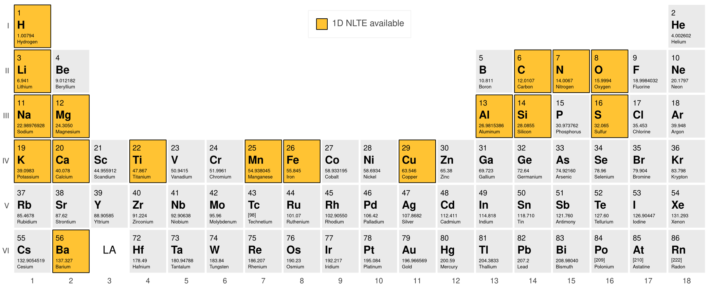

## NLTE correction

The non-Local Thermal Equilibrium (NLTE) correction can be applied to the spectrum by setting the `nlte` attribute of the SME structure, before `synthesize_spectrum` or `solve`:
```py
sme.nlte.set_nlte(el) # such as "Ca"
# Or provide your own grid:
sme.nlte.set_nlte(el, "path_to_your_grid")
```

The current elements with NLTE correction includes:



```{warning}
- Long format VALD linelist is required for NLTE calculations.
If only a short format has been given, then the calculations will only be in LTE. (See [](../fundamentals/linelist.md))
- The NLTE grids are only compatible with the MARCS model atmosphere.
```

```{warning}

```

```{note}
Upon the first use of the NLTE correction, the NLTE grid will be downloaded from the server and this may takes a while, depending on the size of the NLTE grid.
```

Similarly they can be disabled for each element using `sme.nlte.remove_nlte(el)`.

More details on NLTE can be found in the [concept section](../concepts/nlte.md).